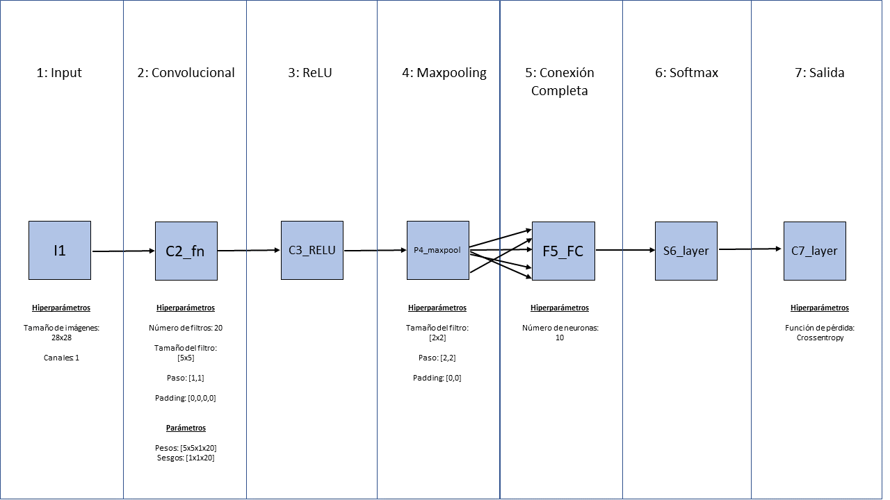

```{r setup, include=FALSE}
library(formatR)
library(kableExtra)
knitr::opts_chunk$set(tidy.opts = list(width.cutoff = 60),echo = FALSE,tidy=TRUE, warning=FALSE, out.width = "70%")
```

1.  \

    

2.1.\
Estas fueron las tasas probadas:

```{r}
tasas_1 <- read.csv("E:\\GDrive1\\Uni\\Master\\tecnologia_conocimiento\\practicas\\convolucional\\2.1_tasas1.csv",sep=";", header=TRUE)
tm <- tasas_1[3,1]
em <- max(tasas_1$exactitud)
knitr::kable(tasas_1, format = "markdown", digits = 6, 
             row.names = FALSE, align = c("l", "c", "r"))
             
```

La em es de `r em`%, con una tm=`r tm`.\
\

```{r}
library(ggplot2)
tasas_2 <- read.csv("E:\\GDrive1\\Uni\\Master\\tecnologia_conocimiento\\practicas\\convolucional\\2.1_tasas2.csv",sep=";", header=TRUE)

tasas_2$nombre <- factor(tasas_2$nombre, levels=(tasas_2$nombre))


             
```

\

```{r}
ggplot(tasas_2, aes(x=nombre, y=exactitud, group=1)) + 
  geom_point(color="blue") +
	geom_line() +
  labs(x="Tasa de aprendizaje", y="Exactitud (%)") +
  ggtitle("Gráfico de tasas de aprendizaje y exactitud")
```

\
2.2\

```{r}
library(tidyr)
tasas_3 <- read.csv("E:\\GDrive1\\Uni\\Master\\tecnologia_conocimiento\\practicas\\convolucional\\2.2_tasas.csv",sep=";", header=TRUE)

tasas_3_long <- gather(tasas_3, key = "exactitud", value = "valor_exactitud", exactitud_10:exactitud_50, factor_key = TRUE)


tasas_3_long$nombre <- factor(tasas_3_long$nombre)
levels(tasas_3_long$nombre) <- c("tm_div20", "tm_div15", "tm_div10", "tm_div5", "tm", "tm_5", "tm_10", "tm_15", "tm_20")
levels(tasas_3_long$exactitud) <- c("1", "2", "3", "4", "5")

```

 Medias de exactitud por épocas:\

```{r}
medias_exact <- data.frame(t(apply(tasas_3[,3:7],2,function(x) mean(x))))
knitr::kable(medias_exact, format = "markdown", digits = 6, 
             row.names = FALSE, align = c("l", "c", "r"))
```

\
2.3\
Como podemos observar, obtenemos una mayor exactitud con tasas de aprendizaje más pequeñas que con múltiplos de la máxima. Esto puede deberse a que el algoritmo converge en una solución subóptima (mínimo local) en los primeros casos, frente a la omisión directa de dichos mínimos en los segundos casos, que inducen errores de detección y clasificación.\
\
Observamos a su vez, que la tasa que da lugar a la exactitud máxima se mantiene hasta llegar a 30 épocas. A partir de las 40, tm/5 supera ligeramente a tm. Este fenómeno se debe a que el algoritmo ha dispuesto de mayor tiempo de entrenamiento.\
\
La media de exactitud más alta (61.8444) se produce con 50 iteraciones, lo cual confirma lo anteriormente expuesto.\
\
3.1\
Basándome en el ejercicio anterior, empleo tm/5 (0.0002) y 50 épocas:

\
3.2\

```{r}
train_acc <- read.csv("E:\\GDrive1\\Uni\\Master\\tecnologia_conocimiento\\practicas\\convolucional\\train_data.csv", header=FALSE,sep=",", dec=".")
val_acc <- read.csv("E:\\GDrive1\\Uni\\Master\\tecnologia_conocimiento\\practicas\\convolucional\\validation_data.csv", header=FALSE,sep=",",dec=".")
train_acc <- as.numeric(train_acc)
val_acc <- as.numeric(val_acc)
val_acc <- na.omit(val_acc)
med_train <- vector("integer",length=150)
contador <- 1
for (i in 1:150) {
	med_train[i]<- mean(train_acc[contador:contador+49])
	contador <- contador+50
}

## Repito el primer valor de las medias de la base de entrenamiento,dado que las validaciones comienzan previo al primer promediado.
med_train<- append(10,med_train)
```

Empleo la prueba no paramétrica de los signos para 2 muestras, dado que tanto las distribuciones de exactitudes de validación como la de las medias de exactitudes de entrenamiento son muy asimétricas.\

```{r}
wilcox.test(med_train, val_acc, alternative = "two.sided", exact = FALSE, correct = FALSE)
```

Por lo tanto, con un 95% de confianza rechazo la H0 de igualdad de medianas, por lo que existe evidencia estadística de sobreajuste.\

```{r}

minilotes <- seq(1, 151)


plot(minilotes, med_train, type = "l", col = "red", lwd = 2,
     xlab = "Minilotes", ylab = "Media de la precisión",
     main = "Media de la precisión en el training vs validación")
     

lines(minilotes, val_acc, type = "l", col = "blue", lwd = 2)


legend("bottomright", legend = c("Training", "Validación"),
       col = c("red", "blue"), lwd = 2)
axis(1, at=seq(0, 151, by=10))

```

Podemos observar como a partir de, aproximadamente, el minilote 36 (iteración 5400), comienzan a separarse ambos conjuntos de forma sistemática.\
\
4.2\
MNIST-MNIST (tm/5 (0.0002),50 épocas, 750 imágenes de training, 100 de test, tamaño de minilote: 50, frecuencia de validación = 50):\
Exactitud =  97 %\
Matriz de confusión:\

```{r}
confMat_42_mnist <- read.csv("E:\\GDrive1\\Uni\\Master\\tecnologia_conocimiento\\practicas\\convolucional\\confMat_42_mnist.csv", header=FALSE,sep=",")

knitr::kable(confMat_42_mnist, format = "latex", digits = 2, 
             row.names = FALSE, align = c("l", "c", "r"), col.names = NULL)
```
MNIST-base propia (tm/5 (0.0002),50 épocas, 750 imágenes de training, 100 de test, tamaño de minilote: 50, frecuencia de validación = 50):\
Exactitud =  22 %\
Matriz de confusión:\
```{r}
confMat_42_propia <- read.csv("E:\\GDrive1\\Uni\\Master\\tecnologia_conocimiento\\practicas\\convolucional\\confMat_42_propia.csv", header=FALSE,sep=",")

knitr::kable(confMat_42_propia, format = "latex", digits = 2, 
             row.names = FALSE, align = c("l", "c", "r"), col.names = NULL)
```
4.3 \
Base propia-MNIST (tm/5 (0.0002),50 épocas, 100 imágenes de training, 100 de test, tamaño de minilote: 5, frecuencia de validación = 5):\
Exactitud = 10 % \
Matriz de confusión = \
```{r}
confMat_43_mnist <- read.csv("E:\\GDrive1\\Uni\\Master\\tecnologia_conocimiento\\practicas\\convolucional\\confMat_43_mnist.csv", header=FALSE,sep=",")

knitr::kable(confMat_43_mnist, format = "latex", digits = 2, 
             row.names = FALSE, align = c("l", "c", "r"), col.names = NULL)
```

Base propia-Base Propia (tm/5 (0.0002),50 épocas, 100 imágenes de training, 100 de test, tamaño de minilote: 5, frecuencia de validación = 5):\
Exactitud = 30% \
Matriz de confusión = \
```{r}
confMat_43_propia <- read.csv("E:\\GDrive1\\Uni\\Master\\tecnologia_conocimiento\\practicas\\convolucional\\confMat_43_propia.csv", header=FALSE,sep=",")

knitr::kable(confMat_43_propia, format = "latex", digits = 2, 
             row.names = FALSE, align = c("l", "c", "r"), col.names = NULL)
```
4.4 \
Extraigo los pesos de entrenamiento por medio de:
```{octave eval=FALSE, echo=TRUE}
writematrix(C2_layer.Weights,"pesos_44X.csv")
```
E inicializo las redes con esos nuevos pesos \
\
MNIST-base propia (tm/5 (0.0002),50 épocas, 750 imágenes de training, 100 de test, tamaño de minilote: 50, frecuencia de validación = 50):\
Exactitud =  26% \
Se ha mejorado la exactitud en un 4%.\
\
Base propia-Base Propia (tm/5 (0.0002),50 épocas, 100 imágenes de training, 100 de test, tamaño de minilote: 5, frecuencia de validación = 5):\
Exactitud = 30% \
No se ha mejorado la exactitud. \
\
4.5 \
En cuanto al 4.2, podemos comprobar cómo el emplear la base de datos propia como test disminuye la exactitud, a pesar de haber igualado las condiciones al testeo con MNIST. Esto puede haberse debido a un fallo propio en el proceso de normalización de las imágenes a un formato similar al de la base original.\
\
Por otra parte, en el 4.3, la baja exactitud con MNIST puede deberse nuevamente a la normalización o falta de entrenamiento. Observamos cómo la mayor exactitud se da entre base propia-base propia, lo cual tiene sentido dado que se testea y entrena con la misma base. A su vez, se da un acuciado overfitting.\
\
Finalmente, en 4.4, la no mejora de exactitud entre base propia-base propia puede encontrar su explicación en la falta de entrenamiento, dado que al emplear MNIST como entrenamiento sí que mejora. \


ANEXO: Código empleado en 4.4. (base propia-base propia)
```{octave eval=FALSE, echo=TRUE}


%
%             RED NEURONAL DE CONVOLUCIÓN
%           
%          EJEMPLO de CLASE (2023). Luis Jáñez. UCM
%    
%                   
%           
%         ENTRADAS:   Imagenes de numeros escritos a mano                    
%                 
%         SALIDAS:    Numero reconocido
%
% ********************************************************************
% REQUISITOS PARA LA EJECUCIÓN DE ESTE PROGRAMA
%
% En las versiones nuevas de Matlab (R2020 y siguientes) basta tener 
% instalada la Toolbox Deep Learning.
%


% ********************************************************************
%  Autor: Luis Jáñez Escalada   
% (C) 2018-23  Luis Jáñez Escalada 
% ********************************************************************


%%%%%%%%% iniciar programa

global plotObj
clearvars

%clc

% Iniciar cronómetro para medir el tiempo de ejecución del programa
datetime
tic
timerVal_60 = tic
 
% Cerrar todas las ventanas abiertas en ejecuciones previas
close all
close all hidden

% abre y cierra todos los ficheros
fopen('all');
fclose ('all');


 

%**************************************************************************
%**************************************************************************
%
%      1. ESTABLECE, CARGA Y REVISA LA BASE DE IMÁGENES A UTILIZAR
%
%**************************************************************************
%**************************************************************************


%  1.1. ESTABLECE LA BASE DE IMÁGENES A UTILIZAR
%**************************************************************************

% BaseImagenesYaDisponible=1;
%  IMAGE BASE digitData CONTENT: 10 000 IMAGES, each having  28x28x1 pixels
% 
% 10×2 table
%     Label    Count
%     _____    _____
%     0        1000 
%     1        1000 
%     2        1000 
%     3        1000 
%     4        1000 
%     5        1000 
%     6        1000 
%     7        1000 
%     8        1000 
%     9        1000 

% UBICACIÓN donde se  hallan las imágenes 

digitDatasetPath = fullfile(matlabroot,'toolbox','nnet','nndemos', ...
        'nndatasets','DigitDataset');
% digitDatasetPath =
%     'C:\Program Files\MATLAB\R2018a\toolbox\nnet\nndemos\nndatasets\DigitDataset'
 
digitData = imageDatastore(digitDatasetPath, ...
        'IncludeSubfolders',true,'LabelSource','foldernames');
    
 %% defino mi base custom
baseCustomPath = fullfile(matlabroot,'toolbox','nnet','nndemos', ...
        'nndatasets','base_custom');
baseCustom = imageDatastore(baseCustomPath, ...
        'IncludeSubfolders',true,'LabelSource','foldernames');


%  1.2. SEPARA LAS MUESTRAS DE APRENDIZAJE Y DE TEST
%**************************************************************************

% Divide the data into training and test sets, so that each category in 
% the training set has 750 images and the test set has the remaining images 
% from each label.

trainingNumFiles = 10;
rng(1) % For reproducibility
% splitEachLabel splits the image files in digitData into two new datastores, 
% trainDigitData and testDigitData.
%[trainDigitData,testDigitData] = ...
    %splitEachLabel( digitData, trainingNumFiles, 'randomize' )  ;
    %% Definir nuevos train y test
    trainDigitData = subset(baseCustom, randperm(length(baseCustom.Files), trainingNumFiles));
    testDigitData = subset(baseCustom, randperm(length(baseCustom.Files), trainingNumFiles));


%**************************************************************************
%**************************************************************************
%
%                    2. CREAR LA RED CONVOLUCIONAL
%
%**************************************************************************
%**************************************************************************


%
% 2.1.  DEFINIR LAS 7 CAPAS QUE VAN A INEGRAR LA RED
% **************************************************

%  ------
%  CAPA 1
%  ------

% C1: capa de entrada

% GUIA en https://es.mathworks.com/help/nnet/examples/create-simple-deep-learning-network-for-classification.html#zmw57dd0e118

% I1_layer
I1_nrows=28; % nº de filas
I1_ncols=28; % nº de columnas
I1_nchan=1;  % nº de canales 
I1_nn= I1_nrows*I1_ncols*I1_nchan; % number of outputs or neurons
I1_layer= imageInputLayer([I1_nrows I1_ncols I1_nchan],...
  'Name','I1_layer',...
  'Normalization','none');
%   'DataAugmentation','randcrop',...
%   'DataAugmentation','randfliplr',...


%  ------
%  CAPA 2
%  ------

% C2: capa convolucional

C2_fn=20; % nº de filtros
C2_ks=[5 5] ; % tamaño del núcleo
%C2_nn= C2_fn * ()
C2_layer = convolution2dLayer(C2_ks, C2_fn,...
    'Name','C2_fn',...
    'WeightLearnRateFactor',1,...
    'BiasLearnRateFactor',1,...
    'Stride',[1,1],...
    'Padding' ,[0,0],...
    'NumChannels','auto',...
    'WeightL2Factor',1,...
    'BiasL2Factor', 1) ;
% % %     'WeightLearnRateFactor',0.0001,...

% C2 initialization
    % The default for the initial weights is a Gaussian distribution
    % with mean 0 and standard deviation 0.01.
    % The default for the initial bias is 0.
    % You can manually change the initialization for the weights and bias.
    % See Specify Initial Weight and Biases in Convolutional Layer EN
    % https://es.mathworks.com/help/nnet/ref/convolution2dlayer.html#bu7fl4y-1 .
% initial standard deviation for weights and biases
%%C2_SDinitWeights=0.01 ;
% Manually initialize the weights from a Gaussian distribution with standard deviation of 0.0001.
%%C2_layer.Weights =  randn([C2_ks(1) C2_ks(2) I1_nchan C2_fn]) * C2_SDinitWeights ;
%% Especifico los pesos basándome en el entrenamiento:
pesos = readmatrix("pesos_442.csv");
 C2_layer.Weights = reshape(pesos, 5,5,1,20);

% Crea la imagen de los pesos iniciales , la amplia y la pinta en la pantalla.

% Obtiene y pinta los pesos iniciales asignados

w1 = C2_layer.Weights;
% Scale and resize the weights for visualization
w1 = mat2gray(w1);
% amplia 4 veces la imagen para verla más grande en la pantalla
w1x4(:,:,1,:) = imresize(w1(:,:,1,:),4,'Method','nearest');
% w1(1,:,3,2)   (columna, fila, profundidad, nº de feature map)
figure
montage(w1x4,'BorderSize',[1 1],'BackgroundColor','yellow' )
title('FILTROS INICIALES EN CAPA CONVOLUCIONAL zoom x 4')


%  -----------------------------------------------
%  CAPA 3       R3: capa de rectificación lineal
%  ----------------------------------------------- 

R3_layer = reluLayer('Name','C3_RELU');


%  -------------------------------------------------
%  CAPA 4     P4 MaxPooling 
%  ------------------------------------------------- 

P4_ks   = [2 2]; % kernel size
P4_stride   = [2 2];
P4_pad   = [0 0];  %=ceil((S4_is - P4_ks + 1) ./ P4_ss);
P4_layer =maxPooling2dLayer(P4_ks,...
    'Name','P4_maxpool',...
    'Stride',P4_stride,...
    'Padding',P4_pad);


%  -----------------------------------------
%  CAPA 5    F5:  capa de conexión completa
%  -----------------------------------------

% F5 layer fullyConnectedLayer(10)
F5_s=10; % nº de neuronas en la capa
%%% F5_layer = fullyConnectedLayer(F5_s) ;
F5_layer = fullyConnectedLayer(F5_s, ...
    'Name','F5_FC', ...
    'WeightLearnRateFactor',1,...
    'BiasLearnRateFactor',1) ;


%  -------------------------------------------
%  CAPA 6     S6:  capa softmax
%  -------------------------------------------

%S6 SoftMax layer
S6_layer = softmaxLayer('Name','S6_layer');


%  ------------------------------------
%  CAPA 7    C7: capa de clasificación 
%  ------------------------------------

%C7 classificationLayer()
C7_layer= classificationLayer('Name','C7_layer');


 

% Imprime en pantalla la definición de las capas para comprobar 
% cómo queda CADA CAPA de la red

I1_layer
C2_layer
R3_layer
P4_layer
F5_layer
S6_layer
C7_layer


% 2.2. CREA LA RED, ENSAMBLANDO LAS CAPAS RECIEN DEFINIDAS 
% ********************************************************

red = [  I1_layer
         C2_layer
         R3_layer
         P4_layer
         F5_layer
         S6_layer
         C7_layer    ];


% Muestra la estructura de la red  para su comprobación

red

%       Da la siguiente salida con la estructura de la red
%       7x1 Layer array with layers:
% 
%          1   'I1_layer'     Image Input             28x28x1 images
%          2   'C2_fn'        Convolution             20 5x5x1 convolutions with stride [1  1] and padding [0  0  0  0]
%          3   'C3_RELU'      ReLU                    ReLU
%          4   'P4_maxpool'   Max Pooling             2x2 max pooling with stride [2  2] and padding [0  0  0  0]
%          5   'F5_FC'        Fully Connected         10 fully connected layer
%          6   'S6_layer'     Softmax                 softmax
%          7   'C7_layer'     Classification Output   crossentropyex


% analyzeNetwork(red) % da una salida gráfica e identifica errores


%**************************************************************************
%**************************************************************************
%
%          3.  ENTRENAMIENTO  DE LA RED
%
%**************************************************************************
%**************************************************************************


% After defining the red (network structure), specify the training options. 
% 
% Set the options to default settings for the stochastic gradient descent 
% with momentum. Set the maximum number of epochs at 15 (an epoch is a 
% full training cycle on the whole training data), and start the training 
% with an initial learning rate of 0.0001.


%          3.1.  ESPECIFICAR LAS OPCIONES PARA EL ENTRENAMIENTO
%**************************************************************************


% Specify the Training Options
% 'sgdm' :stochastic gradient descent with momentum
options = trainingOptions('sgdm',... % 
    'Momentum', 0.7, ... % valor de inercia a aplicar en el descenso por gradiente
    'MaxEpochs',50, ... % nº máximo de veces que pasará todo el conjunto de entrenamiento
    'MiniBatchSize',5,... % tamaño del minilote = nº de casos en cada iteración (= cada cuantos casos se hace retropropagación)    
    'InitialLearnRate',0.0002 ...
    ,... % valor inicial de la tasa de aprendizaje
    'LearnRateSchedule','piecewise',...   %  la tasa de aprendizaje cambia durante el entrenamiento
    'LearnRateDropFactor', 1, ... % factor de reducción de la tasa de aprendizaje ...
    'LearnRateDropPeriod', 5, ...   %     .... que se aplica cada 5 épocas
    'ValidationData', testDigitData, ... % datos para validación durante el aprendizaje
    'ValidationFrequency',5,...  % cada cuántas iteraciones (minilotes) se validará la red
    'Plots','training-progress',...  % Dibujo a realizar; explicado en https://uk.mathworks.com/help/deeplearning/ug/monitor-deep-learning-training-progress.html
    'ExecutionEnvironment','gpu'); % Si dispone de tarjeta gráfica, poner 'gpu'

% Create a set of options for training a network using stochastic gradient 
% descent with momentum. Reduce the learning rate by a factor of 0.2 every 
% 5 epochs. Set the maximum number of epochs for training at 20, and 
% use a mini-batch with 300 observations at each iteration. 
% Specify a path for saving checkpoint networks after every epoch.

% options = trainingOptions('sgdm',...
%       'LearnRateSchedule','piecewise',...
%       'LearnRateDropFactor',0.2,... 
%       'LearnRateDropPeriod',5,... 
%       'MaxEpochs',15,... 
%       'MiniBatchSize',300,...
%       'ExecutionEnvironment','cpu');


%     3.2.   ENTRENAR LA RED  
%*****************************

% Train the network you defined in red, using the training data and the 
% training options you defined in the previous steps.
figure
axis([0 350 0 100])
[convnet,traininfo]= trainNetwork(trainDigitData,red,options);


% traininfo
% Information on the training, returned as a structure with the following fields.
%     TrainingLoss — Loss function value at each iteration
%     TrainingAccuracy — Training accuracy at each iteration if network is a classification network
%     TrainingRMSE — Training RMSE at each iteration if network is a regression network
%     BaseLearnRate — The learning rate at each iteration


%     3.3.   REVISAR EL RESULTADO DEL ENTRENAMIENTO
%**************************************************************************

% Revisar los nucleos de convolución aprendidos en la 1ª capa de convolución
 
convnet.Layers(2)

% Obtiene los valores de los nucleos de convolución aprendidos en la 1ª capa de convolución
w1 = convnet.Layers(2).Weights;

% Escribe en pantalla los valores de los pesos .
w1(:,:,1,2)
%w1(:,:,2,2)
%w1(:,:,3,2)

% Crea la imagen de los pesos, la amplia y la pinta en la pantalla.
% Scale and resize the weights for visualization
w1 = mat2gray(w1);
[s1,s2,s3,s4]= size (w1) ;

% Pinta la imagen de los pesos
w1x4(:,:,1,:) = imresize(w1(:,:,1,:),4,'Method','nearest');

% Display WEIGHTS of 2nd feature map  at the first layer  of network weights. 
% There are 96 individual sets of weights in the first layer.
% w1(1,:,3,2)   (columna, fila, profundidad, nº de feature map)
figure
montage(w1x4,'BorderSize',[1 1],'BackgroundColor','yellow' )
title('FILTROS FINALES EN CAPA CONVOLUCIONAL zoom x 4')
%             I = imtile(mat2gray(act1),'GridSize',[4 8]);
%             figure
%             imshow(I,[]);impixelinfo
%             imshow(act1(:,:,3),[]);impixelinfo
% Display a montage of network weights. There are 96 individual sets of
% weights in the first layer.
% figure
% montage(w1x5)
% title('First convolutional layer weights')

%im = imread("image9001.png");
%imshow(im);
%imshow(imresize(im, [512 512], 'nearest'));

%act1 = activations(convnet,im,'C2_fn');

%sz = size(act1);
%act1 = reshape(act1,[sz(1) sz(2) 1 sz(3)]);
%I = imtile(mat2gray(act1),'GridSize',[5 4]);
%imshow(I);


%**************************************************************************
%**************************************************************************
%
%     4.  ANALISIS DEL RENDIMIENTO
%
%**************************************************************************
%**************************************************************************


%     4.1.  CLASIFICAR LAS IMÁGENES DE PRUEBA
%**************************************************************************


% Run the trained network on the test set that was not used to train 
% the network and predict the image labels (digits).

% Clasificar las imágenes de test
YTest = classify(convnet,testDigitData);

TTest = testDigitData.Labels;


%     4.2.  CALCULAR INDICES DE RENDIMIENTO
%**************************************************************************


% Calcular e imprimir la exactitud obtenida en el conjunto de TEST.

accuracytest = sum(YTest == TTest)/numel(TTest)  ;
fprintf (1,' \r\n %-s %f8 \r\n', 'EXACTITUD (ACCURACY) CON DATOS TEST: ',accuracytest)  ;


% Calcular matriz de confusión con datos de test
fprintf (1,' \r\n %-s %f8 \r\n', 'MATRIZ DE CONFUSION. DATOS TEST: ' )  ;

confMat = confusionmat(TTest,YTest ) 
 
%         % Convert confusion matrix into percentage form
%         confMat = bsxfun(@rdivide,confMat,sum(confMat,2))


%     4.3.  MUESTRA ACTIVACIÓN DE UN 5
%**************************************************************************

 %filename='C:\Program Files\MATLAB\R2021b\toolbox\nnet\nndemos\nndatasets\DigitDataset\5\image4001.png' ;
 %im = imread(filename);
 %imshow( im )
 %imshow(imresize(im, [512 512], 'nearest'))

 %act1 = activations(convnet,im,'C2_fn');
 %features = activations(convnet,im,'C2_fn')


%**************************************************************************
%  REGISTRAR EL TIEMPO DE EJECUCIÓN DEL PROGRAMA
%**************************************************************************

% abre y cierra todos los ficheros
fopen('all');
fclose ('all');


% registra tiempo de ejecución 
datetime
toc 
toc(timerVal_60)  % displays the time elapsed since the tic command corresponding to timerVal.
elapsedTime = toc(timerVal_60);  % returns the elapsed time since the tic command corresponding to timerVal.
%elapsedTime = toc ;% returns the elapsed time in a variable.
minuteselapsed=elapsedTime/60;
fprintf (1,'\r\n %-s %0.2f ','Minutos de ejecución: ', minuteselapsed );
fprintf (1,'\r\n %-s %0.2f \r\n','Horas de ejecución: ', minuteselapsed/60 );

%*************************************************************************
%  FIN
%*************************************************************************


function stop = stopTrainingAtThreshold(info,thr)

stop = false;
if info.State ~= "iteration"
    return
end

persistent iterationAccuracy

% Append accuracy for this iteration
iterationAccuracy = [iterationAccuracy info.TrainingAccuracy];

% Evaluate mean of iteration accuracy and remove oldest entry
if numel(iterationAccuracy) == 50
    stop = mean(iterationAccuracy) > thr;

    iterationAccuracy(1) = [];
end

end

```


